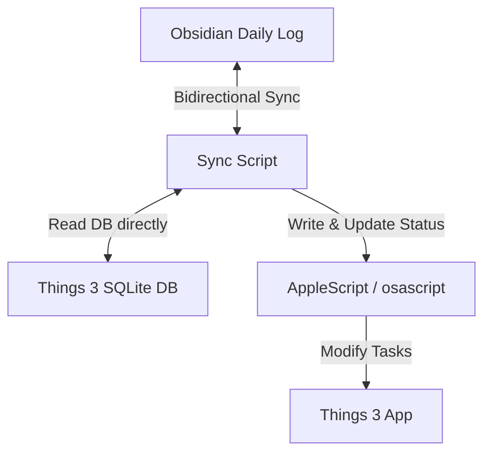

# Obsidian <-> Things 3 Bidirectional Task Sync

A lightweight, local, and robust Python script to synchronize tasks bidirectionally between your **Obsidian Daily Logs** and **Cultured Code Things 3** on macOS.

---

## Features

- **Privacy-First & Offline**: Runs entirely on your local machine using Things 3's SQLite database and macOS AppleScript. No third-party servers or APIs are used.
- **Obsidian -> Things Sync**: Automatically exports new tasks in your Daily Logs (`- [ ] Task Title`) to Things 3 Inbox, appending a hidden comment `%%things:UUID%%` for tracking.
- **Things -> Obsidian Sync**: Imports new tasks tagged with `#obsidian` created in Things 3 directly into today's Obsidian Daily Log under the `## Tasks` section.
- **Bidirectional Status Update**: Automatically syncs completion status between both apps. Marking a task completed in Obsidian completes it in Things, and vice versa.
- **Context-Aware Notes**: Tasks created in Things include an Obsidian deep-link (`obsidian://open?...`) pointing back to the Daily Log file, making it easy to navigate.

---

## How It Works



1. **Task Mapping**: The script parses your Obsidian Daily Logs (`YYYYMMDD.md` format) and checks for markdown tasks. When a task is synced, the script appends `%%things:UUID%%` to the line. This is a standard Obsidian comment, so it will be **hidden in Reading Mode** but visible in Editing Mode.
2. **Fast Status Queries**: Instead of calling slow AppleScript commands for every check, the script reads your current Things 3 task statuses directly from its local SQLite database (`main.sqlite`).
3. **Safe Status Updates**: To avoid database corruption, all write operations (creating tasks and marking them complete/incomplete) are performed safely via Things 3's official AppleScript interface.

---

## Installation & Setup

### 1. Prerequisites
- macOS with **Things 3** installed and running.
- **Python 3.x** installed.
- Obsidian Vault on the local filesystem.

### 2. Configuration
Clone this repository to your local directory. Copy the configuration template and customize it for your local environment:

```bash
cp config.json.example config.json
```

Open `config.json` and update the parameters:

```json
{
  "obsidian_vault_path": "/Users/YOUR_NAME/Documents/Obsidian Vault",
  "daily_logs_relative_path": "02_Areas/Calendar",
  "things_db_path": "/Users/YOUR_NAME/Library/Group Containers/XXXXXXX.com.culturedcode.ThingsMac/ThingsData-YYYYY/Things Database.thingsdatabase/main.sqlite",
  "sync_days": 7,
  "things_import_tag": "obsidian"
}
```

> [!TIP]
> **To find your Things 3 SQLite Path:**
> Run the following command in Terminal to locate your local `main.sqlite` file:
> ```bash
> find "$HOME/Library/Group Containers" -name "main.sqlite" | grep "Things"
> ```

### 3. Git Exclusions
The `config.json` contains your personal paths and username. A `.gitignore` file is included in this repository to prevent you from accidentally committing your local config file.

---

## Usage

### Run Manually
To run a synchronization, execute the following command:

```bash
python3 sync.py
```

### Automation (Recommended)
You can automate the sync process using macOS `cron` or `launchd`.

#### Example cron setup:
To run the sync script every 15 minutes, run `crontab -e` and add the following line:

```bash
*/15 * * * * cd "/path/to/obsidian-things" && /usr/bin/python3 sync.py >/dev/null 2>&1
```

---

## License
MIT License
