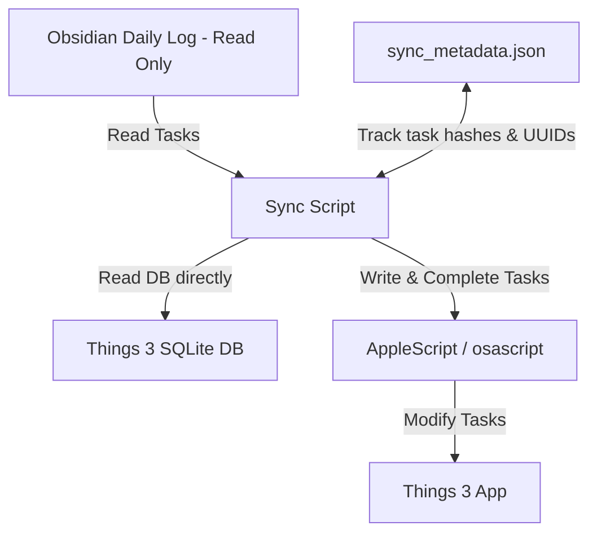

# Obsidian -> Things 3 Task Sync (Read-Only Obsidian)

A lightweight, local, and robust Python script to synchronize tasks from your **Obsidian Daily Logs** to **Cultured Code Things 3** on macOS, keeping your Obsidian markdown files **completely untouched (Read-Only)**.

---

## Features

- **Strictly Read-Only for Obsidian**: The script scans your markdown files for tasks, but it **never modifies, edits, or appends** anything back to your Obsidian vault. 
- **Privacy-First & Offline**: Runs entirely on your local machine using Things 3's SQLite database and macOS AppleScript. No third-party servers or APIs are used.
- **Obsidian -> Things Sync**: Automatically exports new tasks in your Daily Logs (`- [ ] Task Title`) to Things 3 Inbox, maintaining a local mapping database (`sync_metadata.json`) to track task relationships.
- **Status Update Sync**: Checking a task completed in Obsidian (`- [x]`) automatically marks it completed in Things.
- **Context-Aware Notes**: Tasks created in Things include an Obsidian deep-link (`obsidian://open?...`) pointing back to the specific Daily Log file, making it easy to navigate.
- **Robust Mapping**: Task identities are preserved using MD5 content hashing and duplicate occurrence counting, ensuring that modifying line numbers or file headers doesn't break mappings.

---

## How It Works



1. **Strictly Read-Only**: Instead of writing IDs directly to Obsidian daily logs (e.g., via `%%things:UUID%%` comments), the script generates a unique hash of the task's title and its order of occurrence in the daily log.
2. **Metadata DB (`sync_metadata.json`)**: Mappings between task hashes and Things UUIDs are stored locally in the script directory. This file is excluded from Git to prevent private sync tracking leaking to your remote repository.
3. **Legacy Mode**: If your markdown files already contain inline `%%things:UUID%%` comments from previous configurations, the script will automatically import and save them to `sync_metadata.json` for seamless migration.

---

## Installation & Setup

### 1. Prerequisites
- macOS with **Things 3** installed and running.
- **Python 3.x** installed.
- Obsidian Vault on the local filesystem.

### 2. Configuration
Clone this repository to your local directory. Copy the configuration templates and customize them for your local environment:

```bash
cp config.json.example config.json
cp sync_metadata.json.example sync_metadata.json
```

Open `config.json` and update the parameters:

```json
{
  "obsidian_vault_path": "/Users/YOUR_NAME/Documents/Obsidian Vault",
  "daily_logs_relative_path": "02_Areas/Calendar",
  "things_db_path": "/Users/YOUR_NAME/Library/Group Containers/XXXXXXX.com.culturedcode.ThingsMac/ThingsData-YYYYY/Things Database.thingsdatabase/main.sqlite",
  "sync_days": 7
}
```

### 3. Git Exclusions
The `.gitignore` file included in this repository prevents you from accidentally committing your local configuration (`config.json`) and task mapping database (`sync_metadata.json`).

---

## Usage

### Run Manually
To run a synchronization, execute the following command:

```bash
python3 sync.py
```

### Automation (Recommended)
You can automate the sync process using macOS `cron` or `launchd`.

#### Example cron setup:
To run the sync script every 15 minutes, run `crontab -e` and add the following line:

```bash
*/15 * * * * cd "/path/to/obsidian-things" && /usr/bin/python3 sync.py >/dev/null 2>&1
```

---

## License
MIT License
